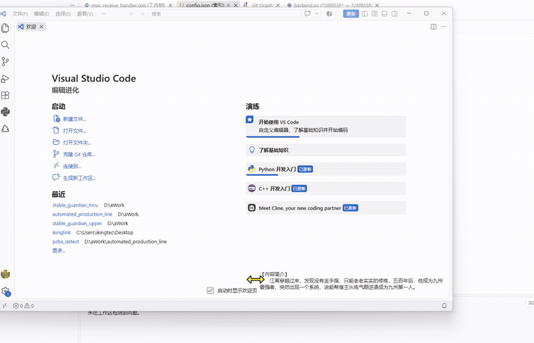
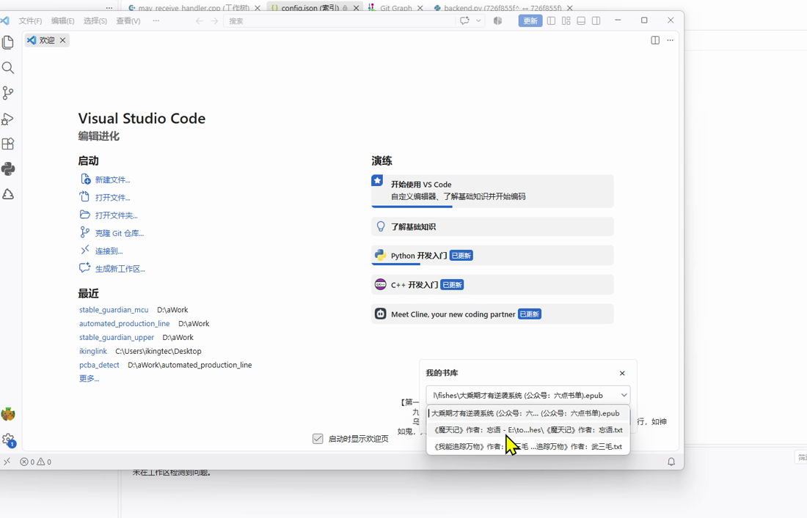
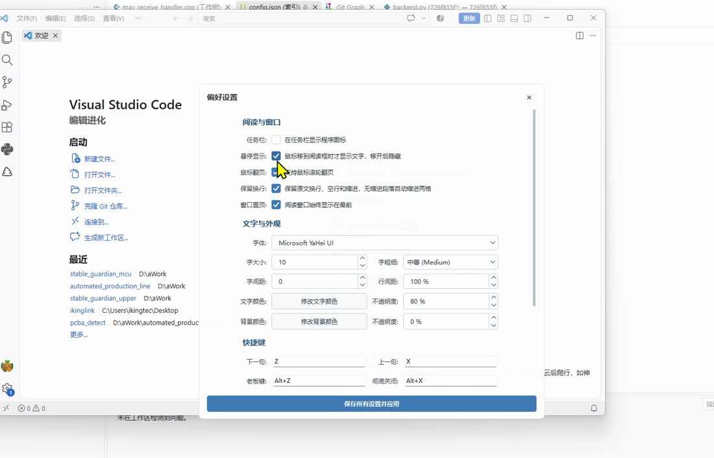

# Reader

一个轻量、无边框的 Windows 离线小说阅读器，适合在桌面上低打扰地阅读本地电子书。常见操作都可通过键盘快捷键完成。

> 本项目基于 [Y3-YYDS/YReader](https://github.com/Y3-YYDS/YReader/) 修改，感谢原作者的开源工作。

## 下载

[下载最新版 Reader（Windows x64）](https://github.com/Qiuyue0125/Reader/releases/latest/download/reader.exe)

下载 `reader.exe` 后可直接运行，并且本程序不会污染系统目录，只会在 exe 同目录下生成一个配置文件。

## 效果预览



### 书库与个性化设置

<p align="center">
  
  
</p>

### 章节目录


按 `C` 可快速打开或关闭章节目录。目录打开后，可直接键入章节标题开头进行快速定位，使用 `↑` / `↓` 选择章节，按 `Enter` 即可跳转。

[查看或下载高清演示视频（MP4）](https://github.com/Qiuyue0125/Reader/releases/download/v1.0.0/demo.mp4)

## 主要功能

- 支持打开本地 TXT、EPUB 和 MOBI 文件
- 自动识别章节并显示目录
- 根据窗口尺寸自动排版和翻页
- 支持自动翻页、窗口置顶、透明度调整和悬停显示
- 支持老板键、全局退出键和自定义快捷键
- “我的书库”按最近阅读顺序保存书籍和阅读进度
- 便携配置：`reader_config.json` 保存在程序同一目录
- 单实例运行，并提供系统托盘快捷操作

## 使用方法

### 打开书籍

启动程序后，在阅读窗口点击鼠标右键，选择“我的书库”。首次使用时点击“添加书籍”，选择本地小说文件，然后确认打开；也可以直接在输入框中填写文件路径。

### 阅读与目录

打开文件后，程序会自动识别章节并显示正文。调整窗口大小时，文字会按照当前尺寸重新排版。阅读到当前章节末尾后会自动进入下一章。需要跳转时，可以在右键菜单中打开“章节目录”，也可以按 `C` 快速打开；随后直接键入章节标题开头进行定位，使用方向键选择并按 `Enter` 跳转。

### 窗口与显示

阅读窗口没有标题栏，可以拖动窗口移动位置，也可以拖动边缘调整大小。右键选择“应用设置”，可调整字体、字号、颜色、透明度、行间距、窗口置顶、悬停显示及鼠标滚轮翻页等选项。

### 自动翻页

在“应用设置”中设置自动翻页间隔并开启自动翻页。再次执行开关操作即可停止，还可以通过快捷键调整翻页速度。

## 默认快捷键

以下快捷键可在“应用设置”的“快捷键”区域修改：

| 功能 | 默认快捷键 |
| --- | --- |
| 下一页 | `Z` |
| 上一页 | `X` |
| 老板键 | `Alt+Z` |
| 彻底关闭 | `Alt+X` |
| 背景加深 | `Ctrl+Up` |
| 背景减淡 | `Ctrl+Down` |
| 文字加深 | `Ctrl+Right` |
| 文字减淡 | `Ctrl+Left` |
| 打开目录 | `C` |
| 开启/关闭自动翻页 | `Ctrl+E` |
| 翻页加速 | `Ctrl+S` |
| 翻页减速 | `Ctrl+W` |

窗口处于前台时还可以使用固定方向键：`←` 上一页、`→` 下一页、`↓` 隐藏/显示、`↑` 彻底关闭。打开目录后，上下键会优先用于选择目录项。

## 从源码运行

需要 Windows 和 Python 3.10 或更高版本：

```powershell
cd reader
python -m pip install -r requirements.txt
python main.py
```

## 打包

```powershell
cd reader
pyinstaller reader_win.spec --clean --noconfirm
```

打包结果位于项目根目录的 `dist` 文件夹。

## 常见问题

### 书籍移动后无法打开

书库保存的是本地绝对路径。文件移动或重命名后，旧记录会提示文件不存在，请在“我的书库”中重新添加文件。

### 为什么隐藏后方向键不能唤回窗口？

方向键只在程序窗口处于前台时生效。隐藏状态下请使用全局老板键（默认 `Alt+Z`）唤回窗口。

## 致谢与说明

本项目是 [YReader](https://github.com/Y3-YYDS/YReader/) 的二次修改版本，并非原项目的官方发行版。原项目及其作者保留其相应权利；本仓库中的修改内容按仓库所附许可说明使用。
